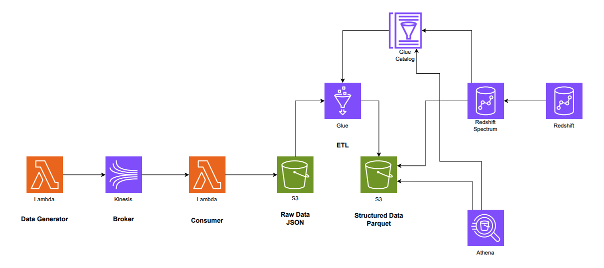

# GlobalSupply Solutions - Supply Chain Optimization (Data Architecture Case Study)

## 📌 Problem Context

*This is a fictional case study created for educational purposes to demonstrate data architecture patterns.*

GlobalSupply Solutions faces the challenge of integrating heterogeneous data from multiple sources (IoT sensors, ERP systems, etc.) to:
- Ensure complete product traceability
- Perform real-time demand forecasting
- Optimize route planning and inventory management
- Process large volumes of semi-structured and unstructured data
- Minimize operational costs while maintaining efficiency

## 🛠️ Proposed Solution

Scalable AWS data architecture featuring:
1. **Real-time ingestion** via Kinesis
2. **Serverless processing** with Lambda
3. **Automated ETL** using Glue
4. **Optimized storage** in S3 (Parquet format)
5. **SQL querying** through Athena and Redshift Spectrum
6. **Data warehousing** with Redshift

## 📊 Architecture

### Data Flow:
1. **Data Generation**: Lambda simulates sensor/ERP data → Kinesis
2. **Consumption**: Lambda processes Kinesis data → S3 (raw/JSON)
3. **ETL**: Glue transforms raw data → S3 (structured/Parquet) + Glue Catalog
4. **Analysis**:
   - Ad-hoc queries via Athena
   - Cross-dataset analysis with Redshift Spectrum
   - Data warehousing in Redshift

## 🛠️ AWS Components

| Service          | Function                                |
|------------------|-----------------------------------------|
| Kinesis          | Real-time data collection               |
| Lambda           | Serverless data processing              |
| S3               | Data Lake (raw + processed layers)      |
| Glue             | ETL pipelines and metadata catalog      |
| Athena           | On-demand SQL queries                   |
| Redshift         | Data Warehouse                          |
| Redshift Spectrum| Query external S3 data                  |

## 📋 Prerequisites

- AWS account with permissions for mentioned services
- Configured AWS CLI (for Terraform/CDK deployment)
- Python 3.x (for Lambda functions)